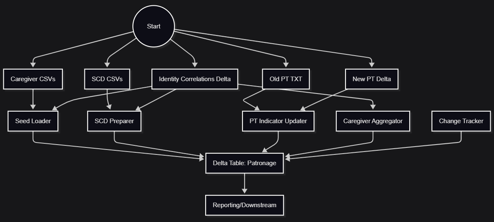
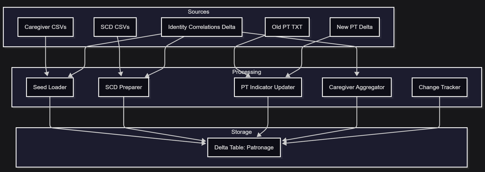
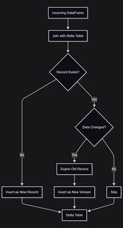

# Patronage ETL Pipeline

A modular databricks Patronage data pipeline for ETL processing using Apache Spark and Databricks.

---
##### How to update these diagrams
- Edit the `.mmd` files in the `docs/` folder using a Mermaid live editor (https://mermaid.live/) or the VS Code Mermaid extension.
- Export each diagram as a PNG and save as `etl_flowchart_alt.png`, `data_lineage_png.png`, and `scd2_upsert_logic.png` in the `docs/` folder.
- The images will then appear above in this README.

---

## 📊 ETL Workflow Diagram


*Figure 1: High-level ETL workflow showing the flow from raw sources through processing steps to the Delta table and reporting.*

---

## 🗺️ Data Lineage Diagram


*Figure 2: Data lineage diagram showing how data moves from all sources, through each transformation, and into the Delta table for reporting.*

---

## 🔄 SCD2 Upsert Logic Flow



*Figure 3: SCD2 upsert logic flow showing how new, changed, and unchanged records are handled in the Delta table.*

---

## 🧩 Project Structure

```
├── src/
│   ├── __init__.py
│   ├── config.py      # Configuration management
│   ├── file_processor.py # Main ETL logic (modularized from notebook)
│   ├── schemas.py     # All Spark schemas
│   └── main.py        # Entrypoint
├── tests/
│   ├── test_config.py
│   ├── test_transformer.py
│   └── test_file_processor.py
├── config.yml        # Sample configuration
├── requirements.txt  # Project dependencies
└── .github/
    └── workflows/
        └── ci.yml    # CI/CD pipeline configuration
```

---

## 🚀 Onboarding: Quick Start for New Team Members

1. **Clone the repository**
2. **Install dependencies:**
   ```bash
   pip install -r requirements.txt
   ```
3. **Configure Databricks connection:**
   - Set up Databricks CLI and configure your profile
   - Ensure you have access to all required data sources (see `config.yml`)
4. **Run the ETL pipeline:**
   ```bash
   python src/main.py --config config.yml
   ```
5. **Run tests:**
   ```bash
   pytest tests/
   ```
6. **Check CI/CD:**
   - All pushes and PRs are tested automatically via GitHub Actions

---

## 🔎 Business Logic Overview

- **Seed Load:** Loads initial caregivers from CSV, joins with identity correlations, and writes to Delta table.
- **Incremental Processing:**
  - Scans source directories for new/updated files (Caregiver, SCD, PT Indicator)
  - Prepares and deduplicates data using Spark DataFrames
  - Applies SCD2 logic (Slowly Changing Dimension Type 2) for upserts
  - Tracks changes and logs them in the Delta table
- **Delta Lake:** All data is stored in Delta format for ACID compliance and efficient upserts.
- **Partitioning:** Data is partitioned by batch and record status for performance.
- **Change Tracking:** Each upsert logs what changed, when, and why (for audit and reporting).

---

## 🧪 Testing & Development

- All ETL logic is modular and testable (see `tests/`)
- Use `pytest` for unit and integration tests
- Code style: `black` (formatting), `flake8` (linting)
- CI/CD: See `.github/workflows/ci.yml` for pipeline details

---

## 🤝 Contributing & Support

- Create a new branch for your feature or bugfix
- Add/modify tests as needed
- Open a pull request for review
- For help, see code comments, this README, or ask a senior team member

---

## 📚 References
- Original Databricks notebook: `Patronage V4.ipynb`
- Delta Lake docs: https://docs.delta.io/latest/delta-intro.html
- PySpark docs: https://spark.apache.org/docs/latest/api/python/

---
